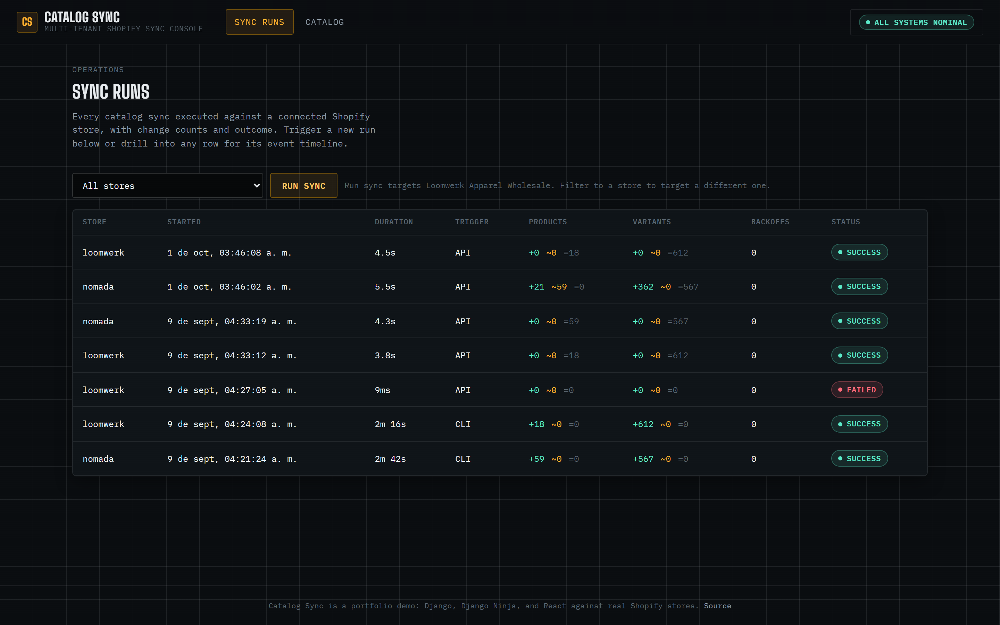

# Catalog Sync

A multi-tenant Shopify catalog sync service: Django + Django Ninja on the
backend, React on the frontend, syncing real product catalogs from two live
Shopify stores into a Postgres-backed local model, with an operations
console to watch it work.

**Live:** <https://catalog-sync-ashy.vercel.app> &nbsp;·&nbsp; **Health:** <https://catalog-sync-ashy.vercel.app/healthz>



It is built to production shape rather than script shape:
cursor pagination against a real rate-limited API, idempotent upserts,
change detection, a signed webhook endpoint, and a health check that
actually checks something. Every number in this README came from running
the sync against the two connected stores, not from a spec.

## Why this shape

**Django Ninja over DRF.** This is a small, mostly-typed API in front of a
React frontend: a handful of read endpoints, one trigger endpoint, one
webhook. Ninja gives Pydantic request/response models, automatic validation,
and a generated OpenAPI schema at `/api/docs` with a fraction of DRF's
serializer/viewset/router boilerplate. DRF's extra machinery (browsable API,
generic viewsets, permission classes tuned for larger surfaces) is not
buying anything at this size. Django itself still does the real work: ORM,
migrations, the admin, management commands.

**Cursor pagination, not offset.** Shopify's Admin GraphQL API does not
support jumping to page N of `products` by offset. The only way to walk a
full catalog is `after: <endCursor>` chained from the previous page's
`pageInfo`. There is no shortcut, so `catalog/shopify_client.py` implements
exactly that: a generator that yields one page at a time and threads the
cursor forward until `hasNextPage` is false. This is also why the sync
scales to a much larger catalog without a design change: page 8,000 costs
the same as page 1, because you're never asking Shopify to skip anything.

**Rate limits handled from the actual signal, not a sleep.** Every Admin
GraphQL response carries `extensions.cost.throttleStatus`: how many cost
points are available right now (`currentlyAvailable`) and how fast the
bucket refills (`restoreRate`). `ShopifyGraphQLClient._wait_for_bucket`
reads that before every request and only sleeps if the bucket is actually
too low for the next call, for exactly as long as the math says it needs
to. A fixed sleep either wastes time on a mostly-empty bucket or still gets
throttled on a busy one; reading the real state is the only version that is
correct on a 59-SKU store and a 400k-SKU one. `execute()` separately
retries on an outright `THROTTLED` GraphQL error or an HTTP 429, with
backoff, in case the proactive check ever falls behind reality. Every
backoff, proactive or reactive, is recorded as a `SyncEvent` so it shows up
in the run's timeline in the UI, not just in a log file.

**Idempotent by construction, not by luck.** Every product and variant is
upserted keyed on its Shopify GID (globally unique, stable across syncs).
Before writing anything, `catalog/sync.py` hashes the fields that matter
(title, handle, vendor, type, status, tags, and every variant's title/
sku/price/inventory) and compares it to the stored hash. Unchanged rows are
never written, only their `last_synced_at` is touched via a targeted
`.update()`. Re-running the sync against an unchanged catalog is a true
database-level no-op: see "What the sync actually did" below for the
before/after run numbers.

**`/healthz` checks real dependencies.** It runs an actual `SELECT 1`
against the database (a connection object can be truthy while the query
engine is wedged) and reports how long ago each active store's last
successful sync finished, flagging anything older than 24 hours as
degraded. The endpoint returns HTTP 503 when it isn't healthy, not 200 with
a sad body, because a load balancer or uptime check only acts on the status
line. This is a direct reaction to having shipped a health check once that
returned 200 while the service behind it was down: this one has to fail
loudly if the thing it's protecting is actually broken.

## React Native client

`mobile/` is an Expo / React Native storefront that reads this catalog as a
shopper, through the Shopify Storefront API, with no Admin credentials on the
device. 51 TypeScript source files across navigation, screens, context,
theming and a typed API layer.

What it covers: metaobject-driven theming (every colour, font and radius is
fetched per store and applied at runtime, so switching brand re-themes the app
live), two-brand switching, gesture-driven UI, list performance, platform
divergence between iOS and Android, and hand-written types checked against
verified API responses rather than generated blindly.

See [`mobile/README.md`](mobile/README.md) for the architecture, the theming
model, and the verification notes.

## Data model

`Store` (slug, name, domain, no credential column) → `Product` → `Variant`,
plus `SyncRun` (one row per sync execution, with created/updated/unchanged
counts) and `SyncEvent` (the timeline entries within a run: page fetched,
rate limit backoff, product upserted, error).

Credentials never enter the database. Each store's admin token is read from
an environment variable named after its slug at sync time
(`SHOPIFY_DOMAIN_<SLUG>` / `SHOPIFY_TOKEN_<SLUG>`,
see `catalog/shopify_client.py:credentials_for_store`), so a database dump
or an admin screenshot can never leak one.

## Merchant API

The React Native app reads this store's data as a *shopper*, through the
Storefront API, with no Admin credentials anywhere in the client. `catalog/
merchant_api.py` adds a second persona: the brand's merchandiser, who edits
PDP module copy and decides which modules appear on which product, with no
developer involved. That persona needs Admin-level writes
(`metaobjectUpdate`, `metafieldsSet`/`metafieldsDelete`), and the Storefront
API has no mutations for either, so those writes have to happen somewhere
with an Admin token. Giving the mobile app that token directly would defeat
the entire point of splitting Storefront (shopper) access from Admin
(merchant) access, so every merchant write goes through this backend
instead, under `/api/merchant/`.

```
GET   /api/merchant/{store_slug}/overview
GET   /api/merchant/{store_slug}/modules
PATCH /api/merchant/{store_slug}/modules/{handle}
GET   /api/merchant/{store_slug}/products?has_modules=true|false|all
PUT   /api/merchant/{store_slug}/products/{product_handle}/modules
```

Every request needs a matching `X-Merchant-Token` header. This is
`APIKeyHeader`-based auth (`MerchantTokenAuth` in `catalog/merchant_api.py`)
checked against a `MERCHANT_API_TOKEN` environment variable, and it fails
closed: if that variable is unset, the check compares the header against an
empty string and rejects every request with 401, the same as a wrong token
would. An unset secret is a deploy mistake, never an implicit "auth
disabled" state.

Reads go straight to Shopify, not the local `Product`/`MetaobjectEntry`
mirror. Those tables are filled in on `SyncService`/`DemoContentProvisioner`'s
own schedule and can lag whatever a merchant just changed from another
client (the Shopify admin UI, this same API from a second device), so a
panel that showed local state right after a save could show something
already stale. `catalog/merchant.py` fetches products and metaobjects fresh
on every request and only writes to the local mirror afterward, to keep it
from drifting further than it already can from changes made outside this
API.

`PUT .../products/{handle}/modules` is a full replacement of
`custom.pdp_modules`, not a merge, matching the endpoint's own contract: the
`handles` list becomes the product's complete set of attached modules. An
empty list detaches everything by deleting the metafield outright
(`metafieldsDelete`) rather than setting its value to `"[]"`, so "nothing
attached" is a real absence, not an empty array a merchant could confuse
with "attached to nothing" while reading the raw metafield in the Admin UI.

## What the sync actually did

Two real, independent Shopify stores are connected:

| Store | Products | Variants |
|---|---|---|
| Nomada Supply Co (`nomada-supply-co.myshopify.com`) | 59 | 567 |
| Loomwerk Apparel Wholesale (`loomwerk-apparel-wholesale.myshopify.com`) | 18 | 612 |

First sync against each store (`manage.py sync_store <slug>`), fetched via
2 and 1 GraphQL pages respectively:

```
Sync #1 (nomada):   59 created, 0 updated, 0 unchanged  |  567 variants created
Sync #2 (loomwerk): 18 created, 0 updated, 0 unchanged  |  612 variants created
```

Immediately re-running the same command against the same stores, with
nothing changed on Shopify in between:

```
Sync #3 (nomada):   0 created, 0 updated, 59 unchanged  |  0 variant changes, 567 unchanged
Sync #4 (loomwerk): 0 created, 0 updated, 18 unchanged  |  0 variant changes, 612 unchanged
```

Zero writes on the second pass, at the database level, not just a "no diff
reported" API response. No rate-limit backoffs were needed at this catalog
size; the backoff machinery is exercised in `catalog/tests/test_sync.py`
and visible in the run-detail timeline's `rate_limit_backoff` event type
whenever Shopify's bucket does run low (it fires automatically past a
few hundred products fetched in a short window).

## Tests

```
pytest -q
# 48 passed
```

Covers, at minimum: the idempotent upsert (a second run against unchanged
data creates and updates nothing), change-detection counts (a real field
change is counted as an update, not miscounted as create or dropped as
unchanged, and a genuinely new product alongside unchanged ones is counted
correctly), the webhook HMAC rejection path (missing signature, wrong
secret, tampered body all rejected; a correctly signed request is
accepted), `/healthz` reporting ok/degraded correctly for no-store,
never-synced, stale, and fresh states, and the merchant API's auth (missing
env var, wrong token, missing header all reject), the full-replacement
semantics of `PUT .../products/{handle}/modules` (attach then detach with
an empty list), and its 404/422 paths (unknown store, unknown module or
product handle, a bad `has_modules` value, a badly-typed PATCH body).

## Running locally

Two terminals, no external services required (SQLite by default):

```bash
# Backend
cd catalog-sync
python -m venv .venv && .venv/Scripts/pip install -r requirements.txt
cp .env.example .env   # fill in DJANGO_SECRET_KEY and the SHOPIFY_* vars for stores you own
python manage.py migrate
python manage.py seed_stores      # creates Store rows from SHOPIFY_DOMAIN_* env vars
python manage.py sync_store nomada
python manage.py runserver 8000

# Frontend
cd catalog-sync/frontend
npm install
npm run dev   # proxies /api to localhost:8000, see vite.config.ts
```

Open `http://localhost:5173`.

## Deployment

Deployed on Vercel: Django runs as a Python serverless function
(`api/index.py`, a two-line WSGI adapter, no code changes from local), the
React build is served as static output, and Postgres is Neon's free tier,
provisioned through Vercel's native Neon marketplace integration
(`vercel integration add neon`, no payment method required, confirmed
`Plan: Free`). `DATABASE_URL` is injected by that integration; every other
setting is an ordinary Vercel environment variable. See `vercel.json` for
the routing (`/api/*` and `/admin/*` to the Python function, everything
else to the built frontend) and `config/settings.py` for how
`DATABASE_URL` is parsed by hand (skipped a dependency for one `urlparse`
call).

## What's simplified at this size, and what production would add

- **Sync trigger runs synchronously in the request.** For 18-59 products
  that is a 1-3 second request. `SyncService.run_sync()` has no
  request-lifecycle dependency, so swapping it behind a queued worker
  (Celery/RQ) for a multi-tenant deployment with hundreds of stores is
  a one-line change at the call site, not a redesign.
- **Webhook processing runs the full sync inline**, for the same reason.
  At real volume this would enqueue a job instead of blocking the webhook
  response, and would scope the resync to the changed product rather than
  the whole catalog.
- **Large-catalog scale (hundreds of thousands of products across hundreds
  of brand partners) is not simulated here** with fabricated data.
  What's demonstrated instead is the part that doesn't change with scale:
  cursor pagination (page cost is constant regardless of catalog size),
  cost-aware backoff (reads the actual bucket state Shopify reports,
  whatever size it is), and idempotent upserts keyed on a stable ID
  (an upsert-by-GID is O(1) per row at any catalog size, not O(n) against
  the existing set). The two connected stores are small on purpose, to
  keep it runnable end-to-end against real infrastructure instead of a
  mock; the patterns don't change shape at 400k rows, only the run
  time and the argument for a background worker get stronger.

